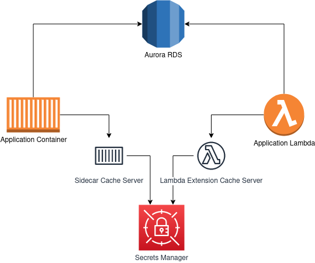
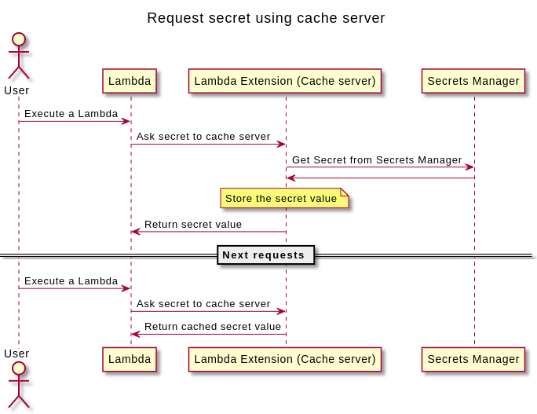
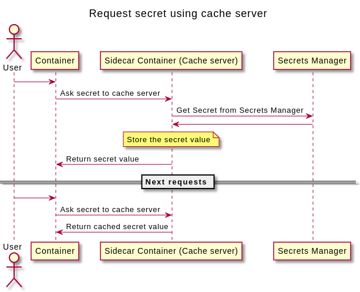

# AWS Lambda Extension / Sidecar Container



## Cache Server

The cache server is written in Golang and it uses the same code to run inside a lambda extension and to run the sidecar container. To be able to run the same extension in different lambda’s runtime, we needed a language that could generate a binary in the end, so we are able to execute the binary directly without caring about the lambda runtime language/version.

The server runs on port 8015 and receives the secret name and the refresh parameters. The refresh parameter is used to invalidate the cache.

## How it works

### Lambda Extension



### Sidecar Container



## Use Case

Use the cache server to retreive database password to connect to the database in different Lambda Runtimes.

Laravel Aurora Connector (https://github.com/cgauge/laravel-aurora-connector) library use this strategy.

Some implementation details can be found here: https://github.com/cgauge/laravel-aurora-connector/blob/main/src/PasswordResolver.php

## Usage

### Lambda Extension

```yml
# CloudFormation
AWSTemplateFormatVersion: '2010-09-09'
Transform: 'AWS::Serverless-2016-10-31'
Resources:
  function:
    Type: AWS::Serverless::Function
    Properties:
      Handler: index.handler
      Runtime: nodejs12.x
      CodeUri: function/.
      Layers:
        - arn:aws:lambda:eu-west-1:12345678:layer:secretsmanager-caching-extension:1

# Serverless Framework
functions:
  hello:
    handler: handler.hello
    layers:
        - arn:aws:lambda:eu-west-1:12345678:layer:secretsmanager-caching-extension:1
```

### Sidecar Container

```yml
# Cloudformation
TaskDefinition:
  Type: 'AWS::ECS::TaskDefinition'
  Properties:
    ContainerDefinitions:
      - Name: Name of your service image
        Image: your.service.image/tag:version
        PortMappings:
          - ContainerPort: '80'
            
      - Name: CacheSecretsService
        Image: customergauge/aws-secretsmanager-caching-sidecar
        PortMappings:
          - ContainerPort: '8015'
    ...
```

## Contributing

Contributions are always welcome, please have a look at our issues to see if there's something you could help with.

## License

AWS Secrets Manager Caching Extension is licensed under LGPLv3 license.